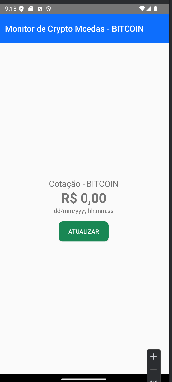
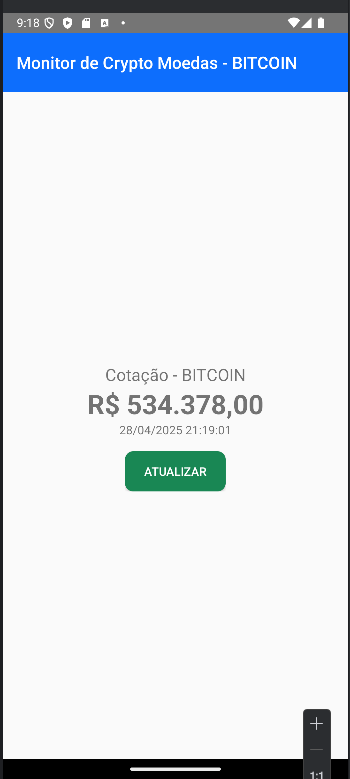
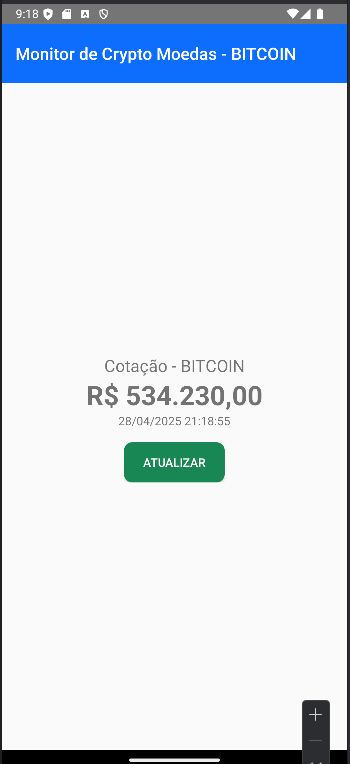

Crypto Monitor - Android

Este projeto foi feito para mostrar a cotação do Bitcoin em tempo real, usando Android com Kotlin.

O objetivo foi aprender como fazer a conexão com uma API, buscar os dados e exibir no aplicativo de forma simples e rápida.

---

 Explicação dos arquivos Kotlin

MercadoBitcoinService.kt (Service)
- Aqui criei uma interface que define a chamada para pegar os dados do Bitcoin.
- Usei o Retrofit para fazer essa comunicação com a API do Mercado Bitcoin.

MercadoBitcoinServiceFactory.kt (Factory)
- Essa classe monta o Retrofit, definindo o endereço da API.
- Ela que gera a instância da conexão que usamos no projeto.

MainActivity.kt (Main)
- Essa é a tela principal que o usuário vê.
- Nela aparece o valor do Bitcoin e tem um botão para atualizar a cotação.

TicketResponse.kt (Model)
- Esse arquivo define o modelo dos dados que chegam da API.
- É aqui que mapeamos as informações como preço, hora da cotação, etc.

---

Prints do App funcionando

**Tela inicial do aplicativo:**

---

**Depois de clicar em "Atualizar":**

---

**Outra atualização:**

---

# ✅ O que foi feito
- Clonei o projeto do GitHub.
- Rodei no Android Studio.
- Testei atualizações do valor.
- Tirei prints como evidência.
- Documentei tudo aqui no README.

---

Projeto feito para a disciplina de Android Kotlin Developer.
